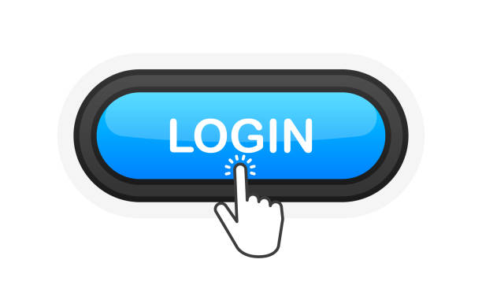

How to Log In to ExpressVPN Account: A Complete Guide
============================================
 
.. toctree::
   :maxdepth: 2
   :caption: Contents:
Discover how to log in to your ExpressVPN account, troubleshoot login issues, and unlock the full potential of this top-tier VPN service.
 

ExpressVPN is one of the leading VPN services known for its strong security, privacy protection, and global server network. To make the most out of this VPN, logging into your ExpressVPN account is essential. Whether you’re using it to stay secure on public Wi-Fi or access geo-restricted content, logging into your account gives you access to all the features ExpressVPN has to offer. This guide will walk you through the steps to log in to your ExpressVPN account, troubleshoot common issues, and answer frequently asked questions about the login process.

How Do I Log In to My ExpressVPN Account?

Logging into your ExpressVPN account is simple and straightforward. Before you can log in, make sure that you have already installed the ExpressVPN app on your device. ExpressVPN supports a variety of platforms including Windows, macOS, iOS, Android, and routers. Here’s a step-by-step guide to logging in to your ExpressVPN account:

Open the ExpressVPN App
Once you’ve installed the app on your device, open it. You will be directed to the login screen where you can enter your credentials.

Enter Your Login Credentials
On the login screen, input your registered email address and password. If you forgot your password or username, you can click the “Forgot Password” option and follow the instructions sent to your registered email address to reset your login details.

Click the "Log In" Button
After entering your login credentials, click the “Log In” button. If the information is correct, you will be granted access to your ExpressVPN account, allowing you to configure your settings, manage your subscription, and connect to VPN servers.

Start Browsing Securely
Once you’ve logged in successfully, you can choose a server location to connect to and begin using ExpressVPN’s features. Whether you want to access content from another country or browse securely, you are now protected by ExpressVPN’s encryption.

Why Is Logging In to ExpressVPN Important?

Logging into your ExpressVPN account is not just about accessing the app, it’s about unlocking a world of customization and control. By logging in, you can take full advantage of the following benefits:

Secure and Private Connection
When logged in, ExpressVPN ensures that your internet connection is protected by encryption. Your login credentials are securely stored, and no logs are kept of your online activities. This provides peace of mind knowing that your privacy is fully protected.

Subscription and Billing Management
After logging in, you gain access to your subscription details. You can view your payment history, update billing information, and even change your plan if you need more connections or additional features.

Device Management
ExpressVPN allows you to use your account on multiple devices. By logging into your account, you can keep track of all the devices connected under your plan and make necessary adjustments, such as logging out from devices you no longer use.

Customizable Settings
Logging into your account allows you to personalize your VPN settings. You can choose preferred server locations, enable features like the kill switch, and set up automatic connection preferences.

Troubleshooting Common ExpressVPN Login Issues

While logging into ExpressVPN is usually quick and seamless, sometimes users may face login problems. Here are some common login issues and how to resolve them:

Forgotten Password or Username
If you’ve forgotten your password, don’t worry. Simply click on the “Forgot Password” link located on the login screen. ExpressVPN will send you a password reset link to your registered email address. Follow the instructions to reset your password and regain access to your account. If you’ve forgotten your username, check the email inbox for the registration confirmation email, which should contain your login details.

Incorrect Login Credentials
Ensure that you’re entering the correct username and password. It’s common to make small mistakes, such as typing errors or forgetting case sensitivity in your password. If the issue persists, reset your password using the steps mentioned above.

App Crashing or Freezing
If the ExpressVPN app freezes or crashes when trying to log in, try restarting your device. Sometimes, temporary bugs or glitches may cause the app to stop responding. If the issue continues, uninstalling and reinstalling the app may fix the problem.

Network Connectivity Problems
Sometimes, network issues can interfere with logging into your account. Ensure that your internet connection is stable, and if necessary, switch between Wi-Fi and mobile data to see if that helps. You can also try resetting your router or contacting your internet service provider for assistance.

Frequently Asked Questions About Logging into ExpressVPN Account

1. Can I log into my ExpressVPN account on multiple devices?
Yes, you can log into your ExpressVPN account on multiple devices simultaneously. ExpressVPN supports several devices, and depending on your subscription plan, you can have multiple active connections. This allows you to secure your laptop, smartphone, tablet, and other devices all at once.

2. What should I do if I forget my password for ExpressVPN?
If you forget your password, simply click on the "Forgot Password" link on the login screen. You will receive a password reset email with instructions to set a new password. If you don't receive the email, check your spam or junk folder.

3. Is it safe to log into my ExpressVPN account?
Yes, logging into your ExpressVPN account is completely safe. ExpressVPN uses AES-256 encryption to secure your login credentials and all communication between your device and its servers. Additionally, ExpressVPN follows a strict no-logs policy, ensuring your online activity is never stored or monitored.

4. Why can’t I log into my ExpressVPN account?
If you're unable to log in, first ensure that you're entering the correct username and password. If you're still having trouble, try resetting your password. It’s also a good idea to check if your device has an internet connection, as connection issues may also affect your ability to log in.

5. Can I manage my ExpressVPN subscription after logging in?
Yes, once logged into your ExpressVPN account, you can manage your subscription settings, including updating your payment information, viewing your billing history, and changing your plan. You can also check the number of devices currently connected to your account.

6. How do I log out of my ExpressVPN account?
To log out of your ExpressVPN account, open the app, navigate to the settings, and click the "Log Out" option. This will disconnect your active VPN session and log you out of the account.

Conclusion

Logging into your ExpressVPN account is the first step toward enjoying a secure and private online experience. Whether you’re looking to access content from different regions or simply protect your data while browsing, ExpressVPN provides the tools you need for a safe internet experience. If you encounter any login issues, the troubleshooting tips above should help you quickly resolve them. By logging into your ExpressVPN account, you unlock the full potential of this powerful VPN service, ensuring that your online activities remain private, secure, and unrestricted.
